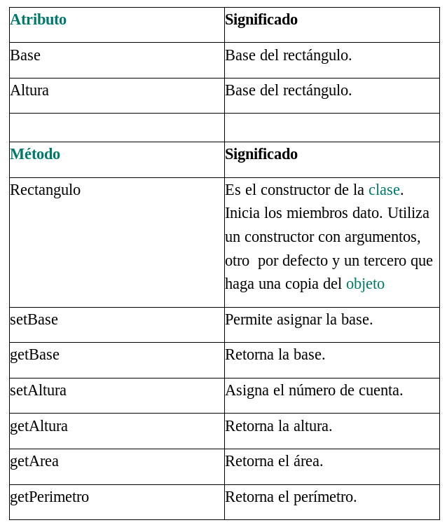

1. Construye un proyecto en Java que utilice la clase Persona que se define a continuación:

```java
public class Persona
{
 String nombre;
 int edad;
 float altura;
 String consulta_Nombre(){
 	return nombre;
 }
 void cambia_Nombre(String nom){
 	nombre=nom;
 }
}
```

La clase debe incluir un método principal que solicite un valor al usuario y lo introduzca en 
el atributo nombre, para posteriormente mostrar por pantalla el nuevo valor del atributo. 

2. Añade a la clase Persona los métodos que faltan para poder consultar y modificar el valor
de todos los atributos. Para ello observa cómo se han creado los métodos del atributo 
nombre y determina los parámetros y resultado de los demás atributos. Después completa 
el programa para comprobar el funcionamiento de los nuevos métodos.

3. De la misma forma que has creado los métodos anteriores, crea ahora un método 
constructor para la clase Persona que al declarar un objeto de tipo Persona asigne los 
siguientes valores a sus atributos:

```
nombre="Luisa Perez" 
edad=22 
altura=1,70 
```

A continuación crea un proyecto que declare un objeto de tipo Persona utilizando el 
constructor, para posteriormente mostrar el contenido de sus atributos por pantalla. 

4. Crea un constructor con parámetros para la clase Persona que inicialice los atributos del 
objeto con los valores indicados en los parámetros. A continuación crea un proyecto que 
declare un objeto de tipo Persona utilizando el constructor, para posteriormente mostrar 
el contenido de los atributos por pantalla. Utiliza el operador this.

5. Construye una clase Complejo con dos atributos:

```
	• real: parte real del número complejo
	
	• imag: parte imaginaria del número complejo
```

Puedes consultar la estructura de una clase en el apartado correspondiente de la unidad, o 
bien partir de la definición de la clase Persona del apartado anterior. A continuación crea 
los siguientes métodos dentro de la clase: 

	• public Complejo(): Constructor que inicializa los atributos a cero. 
	
	• public Complejo(double real, double imag): Constructor que 
	inicializa los atributos a los valores indicados por los parámetros. 
	
	• public double consulta_Real(): Devuelve la parte real del objeto. 
	
	• public double consulta_Imag(): Devuelve la parte imaginaria del objeto.
	
	• public void cambia_Real(double real): Asigna a la parte real del 
	objeto el valor indicado en el parámetro real. 
	
	• public void cambia_Imag(double imag): Asigna a la parte imaginaria 
	del objeto el valor indicado en el parámetro imag. 
	
	• public String toString(): Convierte a String el número complejo, 
	mediante la concatenación de sus atributos y devuelve como resultado la cadena de 
	texto 3 + 4i, si 3 es la parte real y 4 la parte imaginaria. 
	
	• public void sumar(Complejo b): Suma la parte real con la parte real del 
	número complejo b y la parte imaginaria con la parte imaginaria del número 
	complejo b. 

Crea un proyecto que contenga la clase Complejo en un paquete llamado numeros y 
pruebe todos sus métodos con otra clase llamada PruebaComplejos

Visita el siguiente enlace para conocer algo más de los números complejos:


5. Atributos de clase. Población.

Crear una clase Individuo con atributos DNI (de tipo cadena), nombre y año de nacimiento. Incorpora un constructor general que reciba como parámetros los 3 atributos anteriores. Incorporar métodos getter() y setter() a través de la utilidad que tendrán los IDE´s como Eclipse o Netbeans para automatizar dicho proceso (investiga para ver cómo hacerlo). Incorporar un atributo estático o de clase que controle la población (cantidad de individuos)  y que llamaremos poblacion. Posteriormente, en el método principal, instanciaremos una serie de elementos Individuo, comprobando que el valor del atributo de clase poblacion se actualiza, efectivamente, con el número de individuos instanciados.

6. Clase Racional.

Comprueba que la  clase siguiente funciona correctamente. Sin embargo, es mejorable en su diseño: no dispone de un constructor explícito, el método main está codificado en el mismo fichero fuente, no se especifican modificadores de acceso a los miembros de la clase, etc.. Modifica la aplicación subsanando los inconvenientes antes indicados.

```java

class CRacional

{

  int numerador;

  int denominador;

 

  void asignarDatos(int num, int den)

  {

    numerador = num;

    if (den == 0) den = 1; // el denominador no puede ser cero

    denominador = den;

  }

 

  void visualizarRacional()

  {

    System.out.println(numerador + "/" + denominador);

  }

 

  public static void main (String[] args)

  {

    // Punto de entrada a la aplicación

    CRacional r1 = new CRacional(); // crear un objeto CRacional

   

    r1.asignarDatos(2, 5);

    r1.visualizarRacional();

  }

}
```
7. Clase Circulo.

Crea una clase denominada Circulo  con los siguientes datos:

 

* Miembros dato:

    - El radio.

 

* Métodos:

    - Dos constructores, uno que reciba el radio como argumento; y otro, que por defecto le asigne al radio el valor 2.


    - Un método de instancia u objeto denominado calcularSuperficie que devuelva el área del círculo. Sabemos que el área es igual a PI multiplicado por el radio al cuadrado. PI = 3.141592.


Construye otro fichero denominado TestCirculo donde se arranque la aplicación. Crea un círculo de radio 10 llamado circulo1 y visualiza su área. A continuación, instancia otro círculo circulo2 cuyo radio sea el asignado por defecto y muestra igualmente su área.

 

8. Clase Rectangulo.

Diseña una clase denominada Rectangulo teniendo en cuenta la información siguiente:



Incorpora en el proyecto una clase TestRectangulo con un método main() que permita instanciar un objeto de la clase Rectangulo para calcular su perímetro y área. 